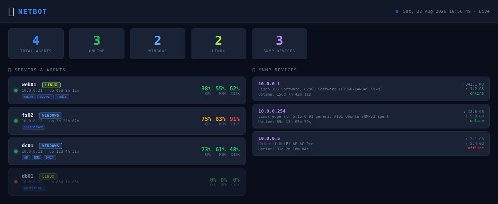

<div align="center">


# TeleOps

**A unified NOC platform for Telegram — monitor agents, discover SNMP devices, run a live dashboard, and manage Linux and Windows hosts from chat commands.**

<a href="https://github.com/OneByJorah/TeleOps/stargazers"></a>
<a href="https://github.com/OneByJorah/TeleOps/commits"></a>


</div>


## What This Is

TeleOps turns Telegram into a network operations console. A bot fronts a set of cross-platform agents, an SNMP discovery engine, and a live web dashboard, so you can check host health, run signed commands, and get threshold alerts without opening a terminal or a monitoring portal.

It is built for small NOC and homelab operators who want lightweight, self-hosted infrastructure monitoring that reaches them where they already are — chat.

## Quick Start

```bash
git clone https://github.com/OneByJorah/TeleOps.git
cd TeleOps

cp .env.example .env        # set TELEGRAM_BOT_TOKEN and ADMIN_CHAT_IDS
docker compose up -d
```

Open **http://localhost:5000** for the dashboard. The agent server listens on **http://localhost:8080**.

> [!WARNING]
> The `bot` service needs a valid Telegram token to stay up. Check `docker logs netbot` after editing `.env`. On first run the entrypoint seeds `config/config.yaml` from `.env`.

## Features

- **Telegram control plane** — admin-gated commands for status, agents, SNMP, and per-host actions.
- **Cross-platform agents** — a stdlib Linux agent and a PowerShell 5.1 Windows agent with HMAC-SHA256 signed command dispatch.
- **SNMP discovery** — automated device discovery and polling over SNMP v1/v2c/v3.
- **Live dashboard** — Flask + SocketIO API with REST polling fallback.
- **Alert management** — CPU/memory/disk thresholds, cooldown, and agent offline detection.
- **Agent server** — self-registration, heartbeat, and installer downloads over HTTP.
- **Windows host management** — AD, DNS, and DHCP actions from the Windows agent.
- **Redis-backed state** — durable job/state storage with append-only persistence.

## Architecture

```
Telegram Admin ──commands──▶ NetBot ──HMAC-signed commands──▶ Agents (Linux/Windows)
                                │
      NetworkScanner ──────────▶│  probes http://<host>:7845/info
      SNMPScanner ──────────────▶│  polls v2c communities
                                ▼
              Agent Server (:8080)  ·  Dashboard (:5000)  ·  Alerts → Telegram
```

Agents register themselves (`POST /agent/register`) or are discovered by subnet scan, report heartbeats every 25 s, and execute signed commands (`stats`, `services`, `firewall`, `docker_ps`, AD/DNS/DHCP on Windows, `cmd` on Linux).

## Configuration

Primary configuration lives in **`config/config.yaml`** (copy from `config/config.yaml.example`): discovery networks, SNMP communities, alert thresholds, and heartbeat intervals all live there. Environment variables are read by `bot/main.py` and seeded into YAML by the entrypoint.

| Variable | Default | Description |
|----------|---------|-------------|
| `TELEGRAM_BOT_TOKEN` | *(empty)* | Bot token from BotFather (overrides YAML) |
| `ADMIN_CHAT_IDS` | *(empty)* | Comma-separated Telegram user IDs with admin access |
| `SECRET_KEY` | *(empty)* | HMAC secret shared with agents (overrides YAML) |
| `REDIS_HOST` / `REDIS_PORT` | `redis` / `6379` | Redis connection |
| `REDIS_PASSWORD` | *(generated)* | Redis auth password |
| `DASHBOARD_PORT` | `5000` | Web dashboard port |
| `AGENT_PORT` | `8080` | Agent server port |
| `SNMP_COMMUNITY` | `public` | Default SNMP community |
| `SCAN_INTERVAL_MINUTES` | `60` | Network discovery interval |

## Telegram Commands

| Command | Description |
|---------|-------------|
| `/start` | Initialize the bot (admin menu) |
| `/status` | Agent & SNMP device status overview |
| `/agents` | List registered agents |
| `/dashboard` | Get dashboard URL |
| `/win <host> [action]` | Windows agent menu or action |
| `/lx <host> [action]` | Linux agent menu or action |
| `/snmp list\|scan\|<ip>` | SNMP devices, scan, or poll one device |
| `/alert` | Alert configuration info |

## API & Endpoints

| Endpoint | Method | Description |
|----------|--------|-------------|
| `/` | GET | Dashboard UI |
| `/api/agents` | GET | Registered agents |
| `/api/snmp` | GET | Discovered SNMP devices |
| `/api/summary` | GET | Aggregated status summary |
| `/agent/register` | POST | Agent self-registration |
| `/agent/download/linux` | GET | Linux agent installer script |
| `/agent/download/windows` | GET | Windows agent installer script |
| `/install/linux` | GET | Linux install helper |
| `/install/windows` | GET | Windows install helper |
| `/health` | GET | Agent server health |

## Use Cases

1. **Homelab operators** — monitor a mixed Linux/Windows fleet from Telegram.
2. **Small NOCs** — combine agent metrics and SNMP devices in one dashboard.
3. **Remote admins** — run signed host commands without a VPN into a jump box.

## Tech Stack

Python 3.10+, python-telegram-bot, aiohttp, Flask + Flask-SocketIO, pysnmp, Redis, SQLAlchemy, PowerShell (Windows agent), Docker Compose.

## Screenshots

| Dashboard | Overview |
|---|---|
|  |  |

More captures live in [`docs/screenshots/`](docs/screenshots/).

## Security

Agent `/command` endpoints require HMAC-SHA256 signatures over `timestamp:body` with a ±5-minute freshness window. The dashboard and agent server expose operational data without authentication — do not expose ports 5000/8080 to untrusted networks. See [SECURITY.md](SECURITY.md).

## Contributing

Contributions are welcome — see [CONTRIBUTING.md](CONTRIBUTING.md). [Open an issue](https://github.com/OneByJorah/TeleOps/issues) to report a bug or request a feature.

## License

MIT — see [LICENSE](LICENSE).

## Connect

- [jorahone.com](https://jorahone.com)
- [GitHub Org](https://github.com/OneByJorah)
- [info@jorahone.com](mailto:info@jorahone.com)
