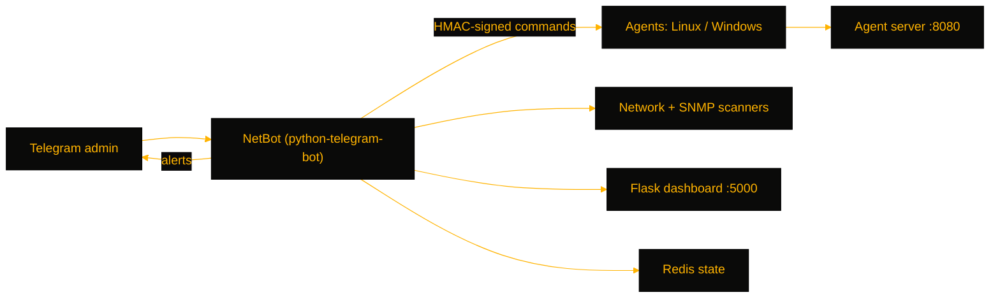

# TeleOps

> Telegram-fronted NOC console — monitors Linux and Windows hosts with cross-platform agents, discovers SNMP devices, and serves a live dashboard, for small NOC and homelab operators who want alerts and host control from chat.

[](https://github.com/OneByJorah/TeleOps)
[](https://github.com/OneByJorah/TeleOps)
[](https://github.com/OneByJorah/TeleOps/stargazers)
[](https://github.com/OneByJorah/TeleOps/commits)
[](https://github.com/OneByJorah/TeleOps/actions)

## What This Is

Full monitoring stacks are heavy for a handful of servers, and their dashboards are another tab you forget to open. TeleOps moves the control plane to Telegram: a bot fronts a set of cross-platform agents, an SNMP discovery engine, and a live web dashboard, so you can check host health, run signed commands, and receive threshold alerts where you already are — chat. It is built for small NOCs and homelab operators running a mixed Linux/Windows fleet.

## Quick Start

```bash
git clone https://github.com/OneByJorah/TeleOps.git && cd TeleOps
cp .env.example .env   # set TELEGRAM_BOT_TOKEN and ADMIN_CHAT_IDS
docker compose up -d
```

Open **http://localhost:5000** for the dashboard; the agent server listens on **:8080**. Host agents install from `agents/linux/install.sh` or `agents/windows/install.ps1`.

## Features

- Admin-gated Telegram commands for status, agents, SNMP devices, and per-host actions
- Stdlib-only Linux agent and PowerShell 5.1 Windows agent with self-registration and 25 s heartbeats
- HMAC-SHA256 signed command dispatch (`stats`, `services`, `firewall`, `docker_ps`; AD/DNS/DHCP actions on Windows)
- SNMP v1/v2c/v3 device discovery and polling, plus subnet host scanning
- Flask + SocketIO live dashboard with REST polling fallback
- CPU/memory/disk alert thresholds with cooldown and agent-offline detection
- Redis-backed durable job/state storage with append-only persistence

## Architecture



## Stack

Python 3.10+, python-telegram-bot, aiohttp, Flask + Flask-SocketIO, pysnmp, Redis, SQLAlchemy, APScheduler, PowerShell (Windows agent), Docker Compose.

## Contributing

Contributions are welcome — read [CONTRIBUTING.md](CONTRIBUTING.md), then [open an issue](https://github.com/OneByJorah/TeleOps/issues).

## License

MIT — see LICENSE.
