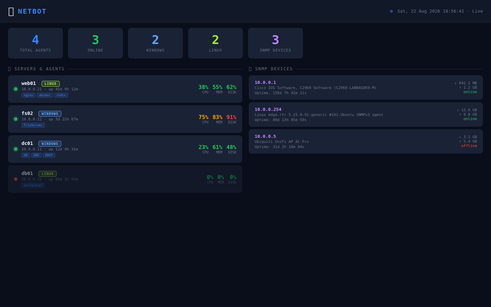

<div align="center">


# TeleOps

Unified NOC platform


</div>

---

<p align="center">
  
</p>

<br>

---

## Features

- **Telegram Bot** — Manage infrastructure via Telegram commands and alerts.
- **SNMP Discovery** — Automated network device discovery and inventory.
- **Live Dashboard** — Real-time monitoring with WebSocket updates (REST polling fallback).
- **Cross-Platform Agents** — Deploy monitoring agents across your infrastructure (HMAC-authenticated).
- **Alert Management** — CPU/memory/disk threshold alerts with cooldown and offline detection.
- **Agent Server** — HTTP endpoint for agent self-registration, heartbeat, and installer downloads.
- **Docker Compose** — One-command deployment.

## How It Works

```
Telegram Admin ──commands──▶ NetBot ──HMAC-signed commands──▶ Agents (Linux/Windows)
                                │
      NetworkScanner ──────────▶│  probes http://<host>:7845/info
      SNMPScanner ──────────────▶│  polls v2c communities
                                ▼
              Agent Server (:8080)  ·  Dashboard (:5000)  ·  Alerts → Telegram
```

Agents register themselves (`POST /agent/register`) or are discovered by subnet scan,
report heartbeats every 25 s, and execute signed commands (`stats`, `services`,
`firewall`, `docker_ps`, AD/DNS/DHCP management on Windows, `cmd` on Linux).

## Quick Start

### Docker (recommended)

```bash
git clone https://github.com/OneByJorah/TeleOps.git
cd TeleOps

cp .env.example .env        # Set TELEGRAM_BOT_TOKEN and ADMIN_CHAT_IDS
docker compose up -d
```

On first run the entrypoint seeds `config/config.yaml` from `.env` values and the
bot starts polling. Open **http://localhost:5000** for the dashboard.

> The `bot:` service needs a valid Telegram token to stay up — check
> `docker logs netbot` after changing `.env`.

### Manual (no Docker)

```bash
pip install -r requirements.txt
cp config/config.yaml.example config/config.yaml   # Fill in token, admin_ids, secret_key
python3 bot/main.py
```

### Telegram Bot Setup

1. Create a bot via [@BotFather](https://t.me/BotFather)
2. Put the token in `.env` (`TELEGRAM_BOT_TOKEN=...`) or `config/config.yaml`
3. Start the bot and send `/start` from an admin account

## Configuration

Primary configuration lives in **`config/config.yaml`** (copy from
`config/config.yaml.example`). See that file for all options: discovery networks,
SNMP communities, alert thresholds, agent heartbeat intervals.

Environment variables (read by `bot/main.py`, set via `.env` in Docker):

| Variable | Default | Description |
|----------|---------|-------------|
| `TELEGRAM_BOT_TOKEN` | *(empty)* | Bot token from BotFather (overrides YAML) |
| `ADMIN_CHAT_IDS` | *(empty)* | Comma-separated Telegram user IDs with admin access |
| `SECRET_KEY` | *(empty)* | HMAC secret shared with agents (overrides YAML) |

## Tech Stack

- **Backend**: Python 3.10+, python-telegram-bot, aiohttp, Flask + Flask-SocketIO
- **Frontend**: HTML/CSS/JS dashboard with SocketIO client + REST fallback
- **Network**: pysnmp for device discovery and polling
- **Agents**: stdlib Python (Linux), PowerShell 5.1+ (Windows)
- **Deployment**: Docker Compose

## Project Structure

```
TeleOps/
├── bot/
│   ├── main.py            # Entry point: wiring, handlers, background tasks
│   ├── handlers.py        # Telegram command & callback handlers (admin-gated)
│   ├── keyboards.py       # Inline keyboard builders
│   ├── scheduler.py       # Heartbeats, metric collection, threshold alerts
│   └── agent_server.py    # aiohttp: /agent/register, downloads, /health
├── discovery/
│   ├── network_scanner.py # Subnet scan probing agents on :7845
│   └── snmp_scanner.py    # SNMP v1/v2c/v3 discovery & polling
├── dashboard/
│   ├── app.py             # Flask + SocketIO API (/api/agents, /api/snmp, /api/summary)
│   └── templates/index.html
├── agents/
│   ├── linux/agent.py     # systemd agent: metrics, signed command dispatch
│   └── windows/agent.ps1  # Scheduled-task agent: AD/DNS/DHCP management
├── config/config.yaml.example
├── tests/
└── docker-compose.yml
```

## Telegram Commands

| Command | Description |
|---------|-------------|
| `/start` | Initialize the bot (admin menu) |
| `/status` | Agent & SNMP device status overview |
| `/agents` | List registered agents |
| `/dashboard` | Get dashboard URL |
| `/win <host> [action]` | Windows agent menu or action |
| `/lx <host> [action]` | Linux agent menu or action |
| `/snmp list\|scan\|<ip>` | SNMP devices, scan, or poll one device |
| `/alert` | Alert configuration info |

## Contributing

Contributions are welcome. Please see [CONTRIBUTING.md](CONTRIBUTING.md) for guidelines and [CODE_OF_CONDUCT.md](CODE_OF_CONDUCT.md) for community standards.

## Security

For security concerns, see [SECURITY.md](SECURITY.md). Please report vulnerabilities privately per that policy — do not use public issues.

Agent `/command` endpoints require HMAC-SHA256 signatures over
`timestamp:body` with a ±5-minute freshness window. The dashboard and agent
server expose operational data without authentication — do not expose ports
5000/8080 to untrusted networks.

## License

[MIT License](LICENSE) © Jhonattan L. Jimenez (OneByJorah)

---

<p align="center">Built with 🌴 by <a href="https://github.com/OneByJorah">OneByJorah</a> · <a href="https://jorahone.com">jorahone.com</a></p>
